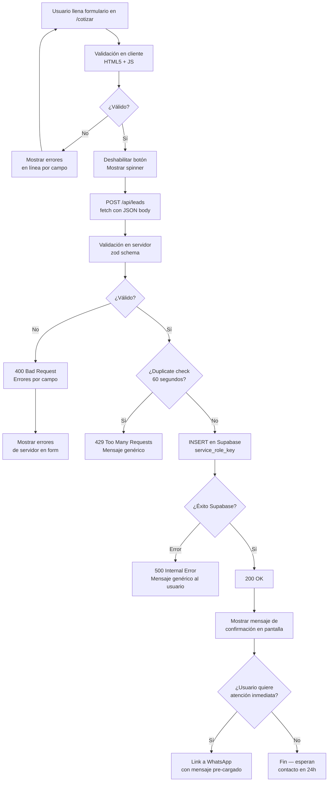

# Arquitectura y Sistema de Diseño — Unidos por GPS Web
_Versión 1.0 — 2026-06-11_

---

## 1. Design Tokens

### 1.1 Paleta de Colores

> **Origen:** Los valores hexadecimales base provienen del análisis visual de `design/referencia-actual/logo.png`. Los valores exactos se confirman y documentan definitivamente en **T01** (task de extracción de marca) usando cuentagotas sobre el archivo de logo. Los valores aquí son aproximaciones válidas para el diseño inicial.

#### Primarios (Navy Blue — color de marca)
| Token | Hex aproximado | Uso |
|---|---|---|
| `brand-primary-950` | `#060E1E` | Fondos muy oscuros |
| `brand-primary-900` | `#0C1C38` | Footer, fondos de sección oscura |
| `brand-primary-800` | `#112450` | Variante oscura de nav |
| `brand-primary-700` | `#162D65` | Color base del logo (confirmar en T01) |
| `brand-primary-600` | `#1B3869` | **Color principal de marca** (logo, CTAs primarios) |
| `brand-primary-500` | `#2248A0` | Hover de botones primarios |
| `brand-primary-400` | `#3D63BC` | Links, íconos secundarios |
| `brand-primary-300` | `#6A8DD0` | Estados disabled, texto secundario sobre oscuro |
| `brand-primary-200` | `#A5B9E5` | Bordes sutiles en fondos oscuros |
| `brand-primary-100` | `#D6E2F5` | Fondos de cards en light mode |
| `brand-primary-50` | `#EDF3FC` | Fondos de sección muy sutiles |

#### Acento (Naranja emergencia — confirmar categoría en T01)
| Token | Hex aproximado | Uso |
|---|---|---|
| `brand-accent-600` | `#C44011` | Hover del acento |
| `brand-accent-500` | `#E85A1C` | Botón emergencia 24/7, badge urgente |
| `brand-accent-400` | `#F07A46` | Hover sobre fondos oscuros |
| `brand-accent-100` | `#FDE8DC` | Fondo badge de emergencia |

> ⚠️ T01 debe determinar si el naranja es parte del sistema de marca o solo un color funcional de UI para emergencias. Hasta entonces, usarlo únicamente para el CTA de emergencia.

#### WhatsApp
| Token | Hex | Uso |
|---|---|---|
| `whatsapp` | `#25D366` | Botón flotante y CTAs de WhatsApp exclusivamente |
| `whatsapp-dark` | `#128C7E` | Hover del botón WhatsApp |

#### Neutrales
| Token | Hex | Uso |
|---|---|---|
| `neutral-900` | `#111827` | Texto principal (body) |
| `neutral-700` | `#374151` | Texto secundario |
| `neutral-500` | `#6B7280` | Texto muted, placeholders |
| `neutral-300` | `#D1D5DB` | Bordes, separadores |
| `neutral-100` | `#F3F4F6` | Fondos de sección alternados |
| `neutral-50` | `#F9FAFB` | Fondo base de página |
| `white` | `#FFFFFF` | Texto sobre fondos oscuros, fondos de cards |

#### Semánticos
| Token | Hex | Uso |
|---|---|---|
| `success` | `#16A34A` | Confirmación de formulario |
| `error` | `#DC2626` | Errores de validación |
| `warning` | `#D97706` | Alertas informativas |

---

### 1.2 Tipografía

#### Fuentes seleccionadas (Google Fonts)

**Plus Jakarta Sans** — headings (H1–H4), labels de UI, hero
- Pesos: 700 (bold), 800 (extrabold)
- Justificación: Geométrica, tech-premium, con personalidad corporativa confiante. Transmite autoridad y modernidad sin ser frívola. Usada por marcas de seguridad y tecnología de nivel internacional.

**Inter** — body, párrafos, labels de formulario, descripciones
- Pesos: 400 (regular), 500 (medium)
- Justificación: El estándar de legibilidad para interfaces web. Hinting perfecto en pantallas de baja densidad (común en mercado peruano), excelente a 14–16px.

#### Escala tipográfica fluida (con `clamp()`)

| Token | Valor | Uso |
|---|---|---|
| `text-xs` | `clamp(0.75rem, 1.5vw, 0.875rem)` | Captions, labels pequeños |
| `text-sm` | `clamp(0.875rem, 2vw, 1rem)` | Texto de ayuda, metadata |
| `text-base` | `clamp(1rem, 2.5vw, 1.125rem)` | Body principal |
| `text-lg` | `clamp(1.125rem, 3vw, 1.25rem)` | Body destacado, intro párrafos |
| `text-xl` | `clamp(1.25rem, 3.5vw, 1.5rem)` | H4, card titles |
| `text-2xl` | `clamp(1.5rem, 4vw, 2rem)` | H3 |
| `text-3xl` | `clamp(1.875rem, 5vw, 2.5rem)` | H2 |
| `text-4xl` | `clamp(2.25rem, 6vw, 3.5rem)` | H1 de secciones internas |
| `text-5xl` | `clamp(2.75rem, 8vw, 4.5rem)` | H1 del Hero |

---

### 1.3 Spacing Scale
Base: 4px (0.25rem). Escala Tailwind estándar extendida con tokens semánticos:

| Token semántico | Valor Tailwind | px |
|---|---|---|
| `section-y` | `py-16 md:py-24` | 64px / 96px |
| `section-x` | `px-4 md:px-8 lg:px-16` | 16/32/64px |
| `container-max` | `max-w-7xl mx-auto` | 1280px |
| `card-p` | `p-6 md:p-8` | 24px / 32px |
| `gap-grid` | `gap-6 md:gap-8` | 24px / 32px |

---

### 1.4 Border Radii
| Token | Valor | Uso |
|---|---|---|
| `rounded-sm` | `4px` | Inputs, badges |
| `rounded-md` | `8px` | Botones, cards pequeñas |
| `rounded-lg` | `16px` | Cards de servicios, modales |
| `rounded-xl` | `24px` | Hero cards, secciones redondeadas |
| `rounded-full` | `9999px` | Pills, botón WhatsApp flotante, avatares |

---

### 1.5 Sombras
| Token | Valor CSS | Uso |
|---|---|---|
| `shadow-card` | `0 1px 3px rgba(0,0,0,0.08), 0 1px 2px rgba(0,0,0,0.06)` | Cards en reposo |
| `shadow-elevated` | `0 4px 12px rgba(0,0,0,0.12), 0 2px 4px rgba(0,0,0,0.08)` | Cards en hover, dropdowns |
| `shadow-floating` | `0 8px 24px rgba(0,0,0,0.18), 0 4px 8px rgba(0,0,0,0.1)` | Botón flotante WhatsApp, toasts |

---

### 1.6 Breakpoints
| Nombre | Min-width | Contexto |
|---|---|---|
| `mobile` | 360px | Móvil pequeño (base de diseño) |
| `md` | 768px | Tablet y móvil grande |
| `lg` | 1280px | Desktop |

Los breakpoints intermedios de Tailwind (`sm`, `xl`, `2xl`) pueden usarse para ajustes finos pero el diseño debe ser perfecto en los tres breakpoints principales.

---

## 2. Dirección de Arte

### 2.1 Look & Feel

**Palabra clave:** _Confianza tecnológica con urgencia peruana._

El sitio debe comunicar:
- **Seguridad y control**: Navy oscuro, tipografía bold, iconografía de escudos y GPS.
- **Tecnología premium**: Espaciado generoso, jerarquía tipográfica clara, fotografía de alta calidad.
- **Accesibilidad humana**: Sin frialdad corporativa excesiva; tono directo, comprensible, cercano al peruano.
- **Urgencia de conversión**: CTAs WhatsApp en verde, acento naranja para emergencia, friction mínima.

El nivel de referencia visual es el de agencias que ganan Awwwards/FWA, pero adaptado al contexto de una empresa de seguridad vehicular en Perú: sin artificios innecesarios, sin animaciones circenses, sin stock genérico de gringa ciudad.

### 2.2 Patrones de Sección

#### Hero (al tope de la Home)
- **Sin carrusel**. Una sola imagen o video loop de fondo con overlay de gradiente navy.
- Headline grande (H1, text-5xl), subheadline concisa, dos CTAs: primario WhatsApp (verde) + secundario "Ver servicios" (outline blanco).
- GPS pin animado sutil como elemento gráfico secundario.
- En móvil: imagen de fondo más compacta, headline en 2–3 líneas, CTAs en columna.

#### Stats Band
- Fondo blanco o neutral-50. 4 estadísticas en grid 2×2 (móvil) o 4 columnas (desktop).
- Número grande (Plus Jakarta Sans 800) + label (Inter 500).
- Animación de contador al entrar en viewport.

#### Pain Point (sección oscura)
- Fondo `brand-primary-900` o `brand-primary-950`.
- Texto blanco. Bullet points con ícono de advertencia o X roja.
- Dos columnas en desktop: izquierda = pain ("¿Qué pasa si te roban?"), derecha = solución ("Así te protegemos").
- En móvil: apilado verticalmente. Separador visual entre pain y solución.
- Animación: fade-in al scroll.

#### Services Preview (cards)
- Grid 2×2 en tablet/desktop, columna en móvil.
- Card con imagen (placeholder con aspect-ratio fijo), título del servicio, descripción 2 líneas, link "Ver más →".
- Hover: elevación (shadow-elevated) + leve translate Y.
- Sin carousel, sin tabs.

#### How It Works (Stepper)
- Fondo `brand-primary-800` o `brand-primary-900` (oscuro de marca).
- Desktop: 4 pasos en fila horizontal, conectados con línea.
- Móvil: 4 pasos en columna vertical, conectados con línea izquierda.
- Número de paso en círculo `brand-accent-500`, título bold, descripción breve.
- Animación: stagger de izquierda a derecha (desktop) / top a bottom (móvil) al entrar en viewport.

#### Stats Band / Testimonials
- Testimonials: cards con foto de avatar (placeholder), nombre, tipo de cliente, texto.
- Fondo neutral-50 o blanco.
- En móvil: scroll horizontal snap o columna. En desktop: grid 3 columnas.

#### CTA Final
- Fondo gradiente de `brand-primary-700` a `brand-primary-900`.
- Headline grande, subheadline, botón WhatsApp verde prominente.
- Puede incluir número de teléfono clickeable.

#### Footer
- Fondo `brand-primary-950`.
- 3 columnas (desktop) / columna única (móvil): Logo + tagline | Links de navegación | Contacto.
- Redes sociales: iconos de Facebook e Instagram.
- Copyright: "© 2024 Unidos por GPS. Todos los derechos reservados."
- Links de política de privacidad al final.

### 2.3 Filosofía de Animación (Framer Motion)
- **Fade-in + slide-up** al entrar en viewport (`whileInView`): todas las secciones.
- **Stagger** en listas y grids: los elementos hijos aparecen con 0.1s de retraso entre sí.
- **Hover de cards**: `scale: 1.02, shadow-elevated` — 200ms ease-out.
- **Contador numérico** en StatsBand al entrar en viewport.
- **Regla de oro**: si la animación no ayuda a guiar la atención o explicar algo, no existe.
- **`prefers-reduced-motion`**: todas las animaciones deben reducirse a `opacity: 0 → 1` simple cuando el usuario lo prefiera.

---

## 3. Arquitectura Técnica

### 3.1 Estructura de Carpetas

```
c:\dev\unidos-gps-web\
├── app/
│   ├── (marketing)/
│   │   ├── layout.tsx              # Layout con Header + Footer + WhatsAppFloat
│   │   ├── page.tsx                # Home
│   │   ├── nosotros/
│   │   │   └── page.tsx
│   │   ├── cotizar/
│   │   │   └── page.tsx
│   │   ├── servicios/
│   │   │   ├── gps-vehicular/page.tsx
│   │   │   ├── gps-flotas/page.tsx
│   │   │   ├── unidos-liberty/page.tsx
│   │   │   └── dashcam-ia/page.tsx
│   │   └── politica-de-privacidad/
│   │       └── page.tsx
│   ├── api/
│   │   └── leads/
│   │       └── route.ts            # POST handler: valida + inserta en Supabase
│   ├── globals.css                 # @tailwind directives + CSS variables de tokens
│   ├── layout.tsx                  # Root layout: <html lang="es">, fuentes, metadata base
│   ├── sitemap.ts                  # Generador de sitemap.xml
│   └── robots.ts                   # robots.txt
├── components/
│   ├── layout/
│   │   ├── Header.tsx              # [CC] Nav responsiva con menú hamburguesa
│   │   ├── Footer.tsx              # [SC] Footer corporativo
│   │   └── WhatsAppFloat.tsx       # [CC] Botón flotante WhatsApp
│   ├── home/
│   │   ├── Hero.tsx                # [SC] Hero section
│   │   ├── StatsBand.tsx           # [CC] Banda de 4 cifras con animación
│   │   ├── PainPoint.tsx           # [SC] Sección oscura pain/solución
│   │   ├── ServicesPreview.tsx     # [SC] Grid de 4 tarjetas de servicios
│   │   ├── HowItWorks.tsx          # [SC] Stepper de 4 pasos
│   │   ├── Testimonials.tsx        # [SC] Sección de testimonios
│   │   └── HomeCTA.tsx             # [SC] CTA final con gradiente
│   ├── services/
│   │   └── ServicePage.tsx         # [SC] Template de página de servicio
│   ├── ui/
│   │   ├── Button.tsx              # [CC] Componente de botón con variantes
│   │   ├── ServiceCard.tsx         # [SC] Card de servicio (usado en ServicesPreview)
│   │   ├── TestimonialCard.tsx     # [SC] Card de testimonio
│   │   ├── StepperItem.tsx         # [SC] Ítem individual del stepper
│   │   └── QuoteForm.tsx           # [CC] Formulario de cotización
│   └── seo/
│       └── StructuredData.tsx      # [SC] JSON-LD para schema.org
├── content/
│   ├── services.ts                 # Datos de los 4 servicios (tipo TypeScript)
│   ├── testimonials.ts             # Testimonios (placeholders hasta T01)
│   └── site.ts                     # Datos del sitio: nombre, contacto, redes
├── lib/
│   ├── supabase-server.ts          # Cliente Supabase server-side (service key)
│   └── validations.ts              # Schemas de validación de formularios (zod)
├── public/
│   ├── images/
│   │   ├── logo.png                # Logo positivo
│   │   ├── logo-negativo.webp      # Logo negativo (blanco)
│   │   └── services/               # Imágenes de cada servicio
│   └── fonts/                      # (si se sirven localmente en el futuro)
├── design/
│   ├── brand/
│   │   └── brand.md               # Creado en T01
│   ├── inspiracion/
│   ├── mockups/
│   │   ├── home-mobile.html        # Creado en T06
│   │   └── home-desktop.html       # Creado en T06
│   └── referencia-actual/          # Screenshots del sitio Odoo (existentes)
├── specs/                          # Este directorio
├── CLAUDE.md
├── tailwind.config.ts
├── next.config.ts
├── tsconfig.json
├── .env.example                    # Keys vacías documentadas (en repo)
├── .env.local                      # Keys reales (no en repo)
└── package.json
```

**[SC]** = Server Component (por defecto en App Router)
**[CC]** = Client Component (requiere `"use client"`)

---

### 3.2 Inventario de Componentes

| Componente | Tipo | Descripción |
|---|---|---|
| `Header` | CC | Navbar responsive. Logo + links + CTA emergencia. Menú hamburguesa en móvil con animación Framer Motion |
| `Footer` | SC | Footer corporativo 3 columnas. Logo, nav, contacto, redes sociales, copyright |
| `WhatsAppFloat` | CC | Botón flotante fijo en esquina inferior derecha. Animación de entrada al cargar |
| `Hero` | SC | Sección hero: imagen de fondo + overlay + headline + 2 CTAs. `priority` en next/image |
| `StatsBand` | CC | 4 stats con animación de contador al entrar en viewport |
| `PainPoint` | SC | Sección bicolor: pain points (dark) + solución (card azul). Fondo oscuro |
| `ServicesPreview` | SC | Grid de 4 `ServiceCard`. Links a páginas de detalle |
| `HowItWorks` | SC | Stepper 4 pasos. Horizontal desktop / vertical móvil |
| `Testimonials` | SC | Grid de testimonios con `TestimonialCard`. Placeholders hasta tener datos reales |
| `HomeCTA` | SC | CTA final: headline + botón WhatsApp + teléfono. Gradiente navy |
| `ServicePage` | SC | Template reutilizable para las 4 páginas de servicio. Props: título, descripción, features, imagen |
| `Button` | CC | Variantes: `primary` (navy), `secondary` (outline navy), `whatsapp` (verde), `accent` (naranja). Tamaños: sm, md, lg |
| `ServiceCard` | SC | Card con imagen (aspect-ratio 16/9), título, descripción, link. Hover animado |
| `TestimonialCard` | SC | Avatar, nombre, tipo de cliente, estrellitas (opcional), texto |
| `StepperItem` | SC | Número en círculo + título + descripción + conector visual |
| `QuoteForm` | CC | Formulario controlado con validación. Estados: idle, loading, success, error |
| `StructuredData` | SC | Renderiza `<script type="application/ld+json">` para schema.org |
| `EmergencyPill` | CC | Badge clickeable con teléfono de emergencia. Usado en Header y Footer |

---

### 3.3 Estrategia de Datos

#### Tabla Supabase: `leads`
```sql
create table public.leads (
  id           uuid primary key default gen_random_uuid(),
  created_at   timestamptz not null default now(),
  nombre       text not null,
  telefono     text not null,
  email        text,
  servicio     text not null,
  num_vehiculos integer not null default 1,
  mensaje      text,
  ip_hash      text,         -- hash de IP para dedup, no dato personal
  source       text not null default 'web-form'
);

-- RLS: solo el service role puede insertar
alter table public.leads enable row level security;

create policy "service_role_insert_only"
  on public.leads
  for insert
  to service_role
  with check (true);
```

#### Variables de Entorno
```bash
# .env.example (en repositorio — sin valores reales)
NEXT_PUBLIC_SUPABASE_URL=
NEXT_PUBLIC_SUPABASE_ANON_KEY=   # Solo para operaciones públicas (si las hubiera)
SUPABASE_SERVICE_ROLE_KEY=       # NUNCA al cliente; solo en API routes
```

#### Contenido en archivos del repo
Los datos de servicios, copy y testimonios se tipan en TypeScript y se importan directamente en Server Components. No hay fetch a APIs externas para contenido.

---

### 3.4 API Route: `POST /api/leads`

```
Request:  POST /api/leads
Headers:  Content-Type: application/json
Body:     { nombre, telefono, email?, servicio, num_vehiculos, mensaje? }

Respuestas:
  200 OK:          Lead insertado exitosamente
  400 Bad Request: Datos inválidos (body JSON de errores por campo)
  429 Too Many:    Reenvío dentro de 60 segundos
  500 Server Error: Error interno (sin detalles al cliente)
```

La API route usa el `SUPABASE_SERVICE_ROLE_KEY` para insertar. Nunca expone el error de Supabase al cliente.

---

### 3.5 Manejo de Imágenes

- Siempre `next/image` — nunca `` HTML nativo.
- Hero: `fill` + `priority` (preload).
- Imágenes de servicios: `width` y `height` explícitos + `sizes` para srcset.
- Formato: WebP preferido, AVIF si el cliente las proporciona. `next/image` optimiza automáticamente.
- Imágenes de stock en placeholders: usar servicio como placeholder.pics o imágenes grises con dimensiones correctas hasta tener fotografías reales.
- Todos los `alt` deben ser descriptivos, no decorativos ("Técnico instalando GPS en vehículo", no "imagen de instalación").

---

### 3.6 SEO Técnico: Metadata por Página

| Página | `<title>` | `<meta description>` |
|---|---|---|
| Home | `Unidos por GPS — Protección Vehicular con GPS en Perú` | `Instala GPS en tu vehículo con instalación gratuita y oculta. Monitoreo 24/7, apagado remoto y app propia. Sin pago de equipo.` |
| GPS Vehicular | `GPS Vehicular Particular — Rastreo en Tiempo Real \| Unidos por GPS` | `Protege tu vehículo particular con GPS de alta precisión. Instalación oculta gratuita, app iOS/Android y soporte 24/7.` |
| GPS Flotas | `GPS para Flotas Empresariales — Control Total \| Unidos por GPS` | `Gestiona tu flota con rastreo en tiempo real, reportes y alertas. Solución GPS para empresas en Perú.` |
| Unidos Liberty | `Unidos Liberty — GPS Portátil para Personas y Objetos \| Unidos por GPS` | `Rastrea personas, niños, adultos mayores o paquetes con el GPS portátil Unidos Liberty. Sin instalación.` |
| Dashcam IA | `Dashcam con Inteligencia Artificial — Seguridad Vehicular \| Unidos por GPS` | `Graba y protege tu vehículo con cámara Dashcam con IA. Detección de incidentes y grabación continua.` |
| Nosotros | `Quiénes Somos — Unidos por GPS` | `Más de 13 años protegiendo vehículos en Perú. Empresa homologada por MTC, OSIPTEL, SUTRAN y OSINERGMIN.` |
| Cotizar | `Cotiza tu GPS — Contáctanos \| Unidos por GPS` | `Solicita tu cotización gratuita de GPS vehicular. Respuesta en menos de 24 horas.` |
| Privacidad | `Política de Privacidad \| Unidos por GPS` | `Política de privacidad y tratamiento de datos personales de Unidos por GPS.` |

---

## 4. Flujo de Cotización — Diagrama


